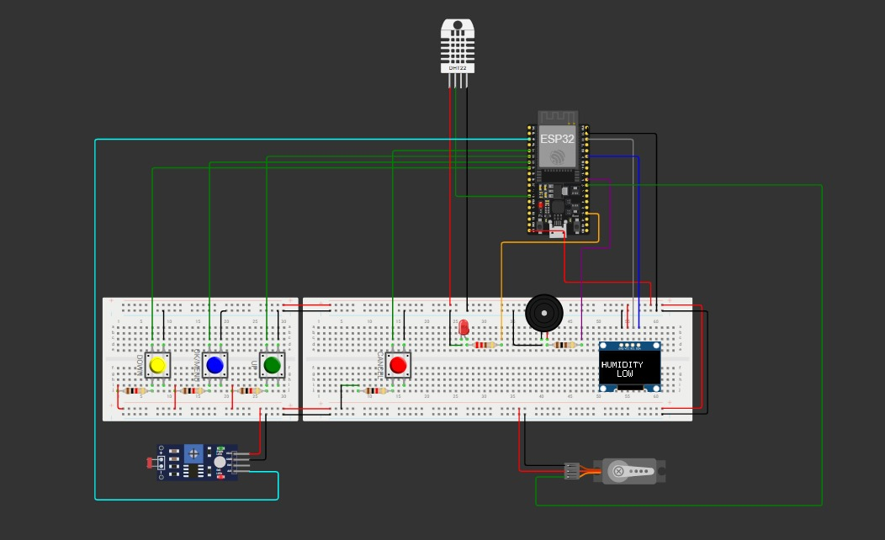
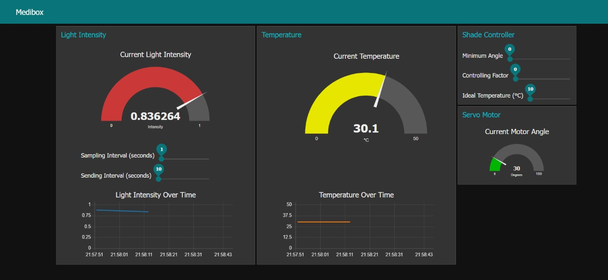

#  Smart MediBox

## Introduction

**Smart MediBox** is an intelligent pharmaceutical storage solution developed using ESP32 and embedded systems technologies. This project was completed in **two phases**:

- **Phase 1**: focused on building a basic medicine reminder system with alarm and environmental monitoring features.
- **Phase 2**: extended the project by integrating dynamic light control, servo motor adjustment, and real-time dashboard visualization via Node-RED.

---

## System Overview

The MediBox combines hardware and software to support:

- Timely medication reminders
- Continuous monitoring of environmental conditions
- Light sensitivity management for medicine storage
- A responsive UI and remote dashboard integration



## Core Functionalities

### Phase 1: Basic Features
- **Time Synchronization** via NTP with time zone configuration
- **Alarm Management**: Set, view, delete, and snooze alarms
- **OLED Display**: Shows current time, active alarms, and warning messages
- **Alarm Notification**: Audible alerts using a buzzer
- **Environmental Monitoring**:
  - Monitors temperature and humidity using DHT11
  - Alerts if out of healthy range (24°C–32°C, 65%–80% RH)

### Phase 2: Advanced Features 
- **Light Intensity Monitoring**:
  - Uses LDR sensors
  - Configurable sampling and update intervals (default: 5s & 2min)
  - Normalized values (0–1) sent to Node-RED dashboard
- **Servo Motor Controlled Shaded Window**:
  - Adjusts based on light and temperature using a custom equation
  - User-configurable parameters:  
    - Minimum angle (θoffset)  
    - Controlling factor (γ)  
    - Ideal temperature (Tmed)
- **Node-RED Dashboard**:
  - Realtime plots, gauges, and sliders for parameter control
  - Remote monitoring and adjustments via MQTT

---

## Software Architecture

The software is modular, layered, and designed for easy expansion.

### 1. Hardware Abstraction Layer (HAL)
- Interfaces with OLED, buzzer, buttons, LDRs, DHT11, and servo motor
- Simplifies low-level interactions and improves code portability

### 2. Sensor Management
- Collects and processes data from DHT11 and LDRs
- Sends real-time sensor data to the communication layer
- Triggers warning displays for unhealthy environmental conditions

### 3. Alarm Management
- Allows adding, deleting, and snoozing medication alarms
- Stores alarm data in non-volatile memory
- Notifies user via buzzer and OLED screen

### 4. Time Management
- Syncs time using an NTP server
- Supports user-defined time zone offset
- Stores time zone settings in persistent memory

### 5. User Interface
- Menu-driven OLED display controlled with push buttons
- Provides alarm and time setup, system status, and warning messages

### 6. Communication Management (MQTT + Node-RED)

Communication is handled via the **MQTT protocol**, using the **HiveMQ broker**.

- **Publishes sensor data** (temperature, humidity, light intensity) to designated MQTT topics for visualization and analysis on the **Node-RED dashboard**
- **Subscribes to control topics** to receive remote commands for the **servo motor**, enabling dynamic adjustment of the shaded window
- Supports full remote monitoring and parameter configuration through the Node-RED interface




##  Node-RED Dashboard Features

- Real-time intensity graph & latest value
- Sliders for:
  - Sampling Interval (ts)
  - Sending Interval (tu)
  - θoffset (0°–120°)
  - γ (0–1)
  - Tmed (10–40°C)

---

## Hardware Components

- ESP32 Development Board
- OLED Display (SSD1306)
- Buzzer
- Push Buttons
- LDR Sensors
- DHT11 Temperature & Humidity Sensor
- Servo Motor (for shaded sliding window)

---

## 💻 Software Requirements

- [Arduino IDE](https://www.arduino.cc/en/software)
- [Node-RED](https://nodered.org/)
- MQTT Broker: [HiveMQ](https://www.hivemq.com/)
- [Wokwi Simulator](https://wokwi.com/)


---

## Installation

### Hardware Setup
- Connect the components to the ESP32 according to the port mapping provided in the repository.

### 🛠️ Software Setup

1. Clone the repository:
  Open a terminal and run:
```bash
git clone https://github.com/RansadiDeAlwis/Smart-MediBox.git
