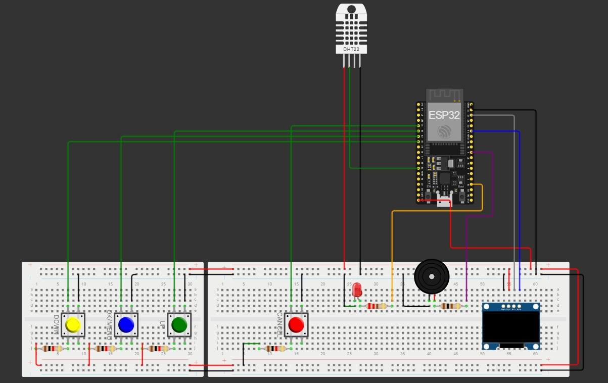

# 💊 Smart Medi Box

A smart, Wi-Fi-enabled medicine reminder system using ESP32 and an OLED display. This project helps users keep track of their medication schedules with timely alarms, temperature/humidity monitoring, and a user-friendly menu system.

---

## 📦 Features

- ⏰ **Multiple Medicine Reminders**: Supports up to 3 customizable alarms.
- 🌡️ **Temperature & Humidity Monitoring**: Integrated DHT22 sensor.
- 📺 **OLED Display Interface**: Clear time, menu, and message display.
- 📡 **NTP Time Synchronization**: Always accurate using Wi-Fi and NTP server.
- 🔊 **Audible Alarm with LED Indication**: Buzzer and LED activate for reminders.
- 🔘 **Interactive Buttons**: 4-button control (OK, Cancel, Up, Down) for menu navigation.
- 🌍 **Time Zone Adjustability**: Set your local time zone manually.

---

## 🛠️ Components Used

| Component         | Description                          |
|------------------|--------------------------------------|
| ESP32 Dev Board  | Microcontroller with Wi-Fi           |
| SSD1306 OLED     | 128x64 pixel I2C OLED display        |
| DHT22 Sensor     | Digital temperature and humidity     |
| Buzzer           | Piezoelectric buzzer for alarms      |
| LED              | Visual cue for alarms                |
| Push Buttons     | For user interaction (4 buttons)     |
| Wires + Breadboard | For circuit setup                   |

---

## ⚙️ Pin Configuration

| Component     | ESP32 Pin |
|---------------|-----------|
| Buzzer        | D5        |
| LED           | D15       |
| DHT22         | D12       |
| Button - OK   | D32       |
| Button - Cancel | D34     |
| Button - Up   | D35       |
| Button - Down | D33       |
| OLED (I2C)    | SDA - D21, SCL - D22 |

---

## 🚀 How It Works

1. **Initialization**:
   - Connects to Wi-Fi.
   - Syncs time using NTP server.
   - Displays welcome message and startup sound.

2. **Main Loop**:
   - Continuously updates time.
   - Monitors for button press to enter the settings menu.
   - Checks and triggers alarms based on configured time.

3. **Menu System**:
   - Adjust Time Zone
   - Configure up to 3 alarms
   - Disable all alarms

4. **Alarm Trigger**:
   - Displays “Take Your Medicine!” message.
   - Activates buzzer and LED until "Cancel" button is pressed.

5. **Environmental Monitor**:
   - Monitors and logs room temperature and humidity (extendable).

---

## 📋 Setup Instructions

1. **Libraries to Install** (via Arduino IDE Library Manager):
   - `Adafruit SSD1306`
   - `Adafruit GFX`
   - `DHT sensor library for ESPx`
   - `WiFi.h` (built-in for ESP32 boards)

2. **Steps**:
   - Clone or download the project.
   - Open the `.ino` file in Arduino IDE.
   - Select `ESP32 Dev Module` as board.
   - Connect your ESP32 and upload the code.
   - Open Serial Monitor for logs (baud rate: 9600).

---

## 👤 Author

**De Alwis W.M.R.**  

